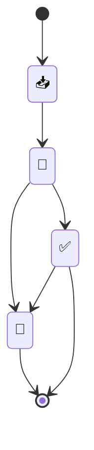

---
{"dg-publish":true,"permalink":"/meta/docs/tag-explanation/","updated":"2025-10-18T19:34:20.507-07:00"}
---

# Complete Tag Taxonomy

## Processing Status
- 📥_New - Fresh captures, unprocessed
- 🌱_Processing - Being worked on, in progress
- ✅_Processed - Completed processing
- 🌲_[[!Core System/Evergreen\|Evergreen]] - Timeless, reference-quality content

## Content Type
- 🕛_Processing_Note - Temporary working notes
- 🔗_Reference - External links and resources
- 📰_Article - Written articles and blog posts
- 📺_Video - Video content and tutorials
- 🎧_Podcast - Audio content and interviews
- 📖_Book - Books and long-form reading
- 🗒️_Note - General notes and observations
- 📍_MOC - Map of Content, navigation hubs
- 🥗_Recipe - Food recipes and cooking
- 💻_Project - Project documentation
- ☢️_[[!Core System/Atomic\|Atomic]] - Atomic notes, core concepts
- 📋_Template - Reusable templates
- 📊_Dashboard - Overview and status pages
- 🎬_Script - Screenplays and scripts
- 📸_Photo - Photography and images
- 🎨_Art - Creative and artistic content
- 🔧_Technical - Technical documentation
- 📚_Course - Educational content and courses
- 🏢_Business - Business and professional content
- 🎭_Creative - Creative projects and ideas

## Project Status
- 💪_Active - Currently in progress
- 🍀_Tending - Regular maintenance required
- 🧊_Frozen - Temporarily paused
- ✅_Done - Completed
- 📋_Planning - In planning phase
- 🔄_Recurring - Ongoing, repeating tasks

## Work Type
- 💼_Client_Work - Paid client projects
- 🎨_Creative - Creative and artistic projects
- 🔧_Technical - Technical development work
- 📝_Writing - Writing and content creation
- 🎬_Video_Production - Video and film work
- 📸_Photography - Photography projects
- 🎵_Audio - Audio and music projects
- 🏢_Business - Business development
- 🎓_Learning - Educational and skill building
- 🏠_Personal - Personal projects and tasks

## Life Areas
- 🫂_family - Family relationships and activities
- 💰_finance - Financial planning and management
- 🎯_goals - Goal setting and achievement
- 🏆_health - Health and fitness
- 🏠_home - Home management and organization
- 🎓_education - Learning and skill development
- 👤_personal - Personal development and growth
- 🌎_travel - Travel and experiences
- 🗂️_work - Professional work and career
- 🎨_creative - Creative practice and projects
- 🔧_technical - Technical skills and development
- 🏢_business - Business and entrepreneurship

## Content Domain
- 🎬_Film - Film and cinema related
- 📸_Photography - Photography and visual arts
- 🎭_Screenwriting - Screenplay and script writing
- 🎵_Music - Music and audio production
- 🎨_Art - Visual arts and design
- 📝_Writing - General writing and literature
- 🔧_Technology - Technology and programming
- 🏢_Business - Business and entrepreneurship
- 🏆_Fitness - Health and fitness
- 🍽️_Food - Food and nutrition
- 🏠_Home - Home and lifestyle
- 🎓_Education - Learning and education
- 🌍_Travel - Travel and culture
- 👥_Relationships - People and relationships

## Output Type
- 🎬_Video - Video content production
- 🏙️_Photo - Photography output
- 📝_Writing - Written content
- 🎵_Audio - Audio content
- 🎨_Visual - Visual art and design
- 💻_Digital - Digital products and tools
- 📚_Educational - Educational materials
- 🏢_Business - Business deliverables
- 🎭_Creative - Creative works
- 🔧_Technical - Technical solutions

## Priority Level
- 🔥_Urgent - Immediate attention required
- ⚡_High - Important, prioritize soon
- 📋_Medium - Standard priority
- 📌_Low - Can wait, lower priority
- 💤_Someday - Future consideration

## Time Sensitivity
- ⏰_Time_Sensitive - Has deadlines
- 📅_Scheduled - Planned for specific time
- 🔄_Recurring - Happens regularly
- 🎯_One_Time - Single occurrence
- 📋_Flexible - No specific timing

## Collaboration Level
- 👤_Solo - Individual work
- 👥_Team - Collaborative work
- 🤝_Client - Client collaboration
- 🌐_Public - Public/community work
- 🔒_Private - Personal/confidential

## Resource Type
- 📚_Learning - Educational resources
- 🔗_Reference - Reference materials
- 🛠️_Tools - Tools and utilities
- 📋_Templates - Reusable templates
- 📊_Data - Data and analytics
- 🎯_Goals - Goal-related content
- 📝_Notes - General notes and thoughts
- 🔍_Research - Research and investigation
- 💡_Ideas - Ideas and concepts
- 📖_Documentation - Documentation and guides

## Special Categories
- 🎯_Goals - Goal-related content
- 📊_Metrics - Performance and tracking
- 🔄_Habits - Habit tracking and development
- 📅_Calendar - Time-based content
- 🏷️_Tags - Tagging and organization
- 🔍_Search - Search and discovery
- 📋_Checklist - Task lists and checklists
- 🎲_Ideas - Brainstorming and ideation
- 📈_Progress - Progress tracking
- 🎯_Milestones - Important achievements

## Usage Guidelines

### Tagging Best Practices
1. **Use multiple tags** - Most content should have 2-4 relevant tags
2. **Be consistent** - Use the same tags for similar content
3. **Start broad, get specific** - Use general tags first, then add specific ones
4. **Update regularly** - Review and update tags as content evolves

### Common Tag Combinations
- **Project work**: `💪_Active` + `💼_Client_Work` + `🔧_Technical`
- **Creative content**: `🎨_Creative` + `📝_Writing` + `🎬_Video`
- **Learning**: `🎓_Learning` + `📚_Course` + `🔍_Research`
- **Reference**: `🔗_Reference` + `🌲_[[Evergreen]]` + domain tag
- **Planning**: `📋_Planning` + `🎯_Goals` + `📅_Scheduled`

### Tag Hierarchy
1. **Processing Status** (always include one)
2. **Content Type** (always include one)
3. **Work Type** or **Life Area** (context dependent)
4. **Domain** (if applicable)
5. **Additional qualifiers** (priority, time sensitivity, etc.)
