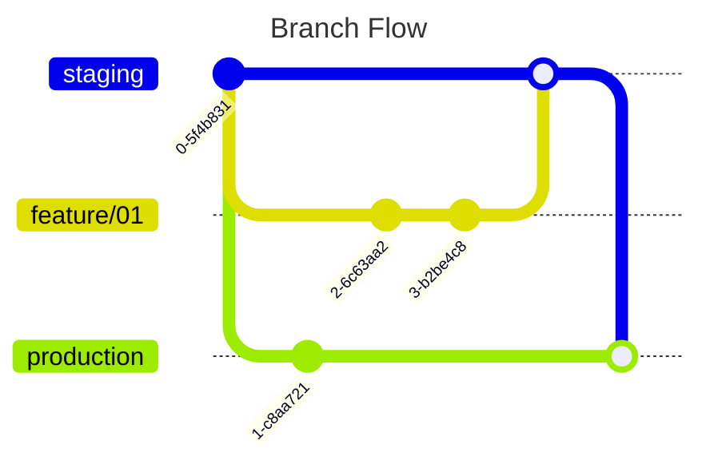

---
{"dg-publish":true,"permalink":"/3-resources/technical/environment-based-development/","tags":["🔧_Technical","🗒️_Note","🌲_Evergreen"],"updated":"2025-10-20T07:52:10.730-07:00"}
---

### Environment-Based Development

Environment-Based Development uses long-lived branches to represent the different environments. In this strategy, `main` doesn't exist.

### Branches
- `staging` - what is currently deployed to `staging`
- `production` - what is currently deployed to `production`

#### Workflow
_the following assumes that all commits will be going into staging, but hotfixes can go directly into production if necessary._

1. Create a branch off of `staging` for a new feature
3. Commit changes to this new branch.
4. PR to merge into `staging`.
5. Merge into `staging`.
6. CI automatically deploys to `staging`.
8. Test in staging.
9. When ready, merge `staging` into `production` (don't squash)
10. CI automatically deploys to `production`

#### Pros
1. It's clear what changes are in what environment based on git commits.
2. Very little overhead.

#### Cons
1. Not very common.
2. Easy to branch off the wrong branch.
3. Hotfixes will need to be reverse-merged into staging.