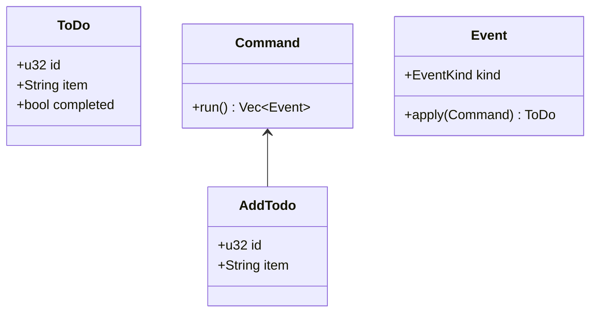

---
{"dg-publish":true,"permalink":"/atlas/swift-ui-swift-data-rust-domain-core/","tags":["programming","🌱","rust","swift","software"],"noteIcon":"","updated":"2024-11-08T06:50:40.152-08:00"}
---

# SwiftUI -> Rust -> SwiftData
<i class="fas fa-heart"></i> Finding Nirvana through UniFFI <i class="fas fa-heart"></i>

# Create the crate

Create the rust core crate.

```shell
cargo new --lib core-functionality
```

The majority of our functionality will go in this crate.

---
## Make it Importable

Edit the `Cargo.toml` file and make it a c-library

```toml
[lib]
crate-type = ["cdylib", "staticlib"]
name = "corefunctionality"
```

`staticlib` is only needed if you plan to target iOS

note:: We use a c-library because that's what Swift can import

---
# Let's write some rust code now
---
## Overview of what we are building

We are going to make a very basic todo list because that's what everyone does.

We are going to use a Command/Event structure where the frontend sends commands to the domain, and the domain responds with Events of what happened in the domain.

---


---
## Domain Object

```rust

struct ToDo {
  id: u32,
  description: String,
  status: bool, // Just to keep it simple
}
```
---
## Commands
Commands are simply an Enum

```rust
#[derive(Debug)]
pub enum Command {
  AddTodo(u32, String),
  CompleteTodo(u32),
  IncompleteTodo(u32),
  EditTodo(u32, String),
}
```

---
## Events
Events are also simply an Enum, always past tense

```rust
pub enum Event {
  TodoCreated(u32, String),
  TodoStatusSet(u32, bool),
  TodoDescriptionSet(u32, String),
}
```

---
## The Runner

We need a way to run the commands, manage the memory for the commands, and call the event handlers. That's where the runner comes in.

---
# To The IDE

note: tag is step01, show the lib.rs and the following in this order: Command, Event, EventHandler, RunnerError, Runner

---
# Adding the interop
---
## Dependencies

```toml
[dependencies]
uniffi = { "version" = "0.26", features = ["cli"] }

[build-dependencies]
uniffi = { "version" = "0.26", features = ["build"] }
```

We need `cli` so that we can automate running `uniffi-bindgen`

---
## build.rs

This will read the interface definition and output rust

```rust
fn main() {
    uniffi::generate_scaffolding("src/corefunctionality.udl")
      .expect("Unable to parse the udl for interop");
}
```

---
## Update lib.rs

Add this to the bottom of your lib.rs

```rust
uniffi::include_scaffolding!("corefunctionality");
```

This loads in the generated code from bindgen

---
# TO THE IDE

note:: tag is step01, show udl

---
## Let's build the swift module

```bash
#!/usr/bin/env bash

LIBRARY_NAME=corefunctionality

set -e

SCRIPT_DIR=$( cd -- "$( dirname -- "${BASH_SOURCE[0]}" )" &> /dev/null && pwd )

cd ${SCRIPT_DIR}

cargo build --release
cargo run --release --bin uniffi-bindgen generate --library target/release/lib${LIBRARY_NAME}.dylib --language swift --out-dir target/swift -n
swiftc -module-name ${LIBRARY_NAME} \
    -emit-library -o lib${LIBRARY_NAME}.dylib \
    -emit-module -emit-module-path ./interop/ \
    -parse-as-library \
    -L ./target/release/ \
    -l${LIBRARY_NAME} \
    -Xcc -fmodule-map-file=./target/swift/${LIBRARY_NAME}FFI.modulemap \
    target/swift/${LIBRARY_NAME}.swift
```

---
## Create the binary to run bindgen
```rust
fn main() {
    uniffi::uniffi_bindgen_main();
}
```

## And update Cargo.toml
```toml
[[bin]]
name = "uniffi-bindgen"
path = "bin/uniffi-bindgen.rs"
```

---
## Run the build script

_If nothing outputs, make sure you included the scaffolding in `lib.rs`_

```rust
uniffi::include_scaffolding!("corefunctionality");
```

---
## Create a basic swift project


---


---
## Create it next to your core-functionality crate

# Configure xcode to include the crate output
---
## Add a bridging header to the project


---

## Add a build rule to generate the bindings


---
## Add the .udl file to Compile Sources in the build phase


---
## import your library header inside the bridging header

```swift
#ifndef BridgingHeader_h
#define BridgingHeader_h

#import "corefunctionalityFFI.h"

#endif /* BridgingHeader_h */
```

---
## Add the library to your project


---

## Add the path to the library search path


---

# Now your project is setup!

## Let's switch to Swift!

---

# To the IDE

notes: Show the `DomainCore.swift` code

