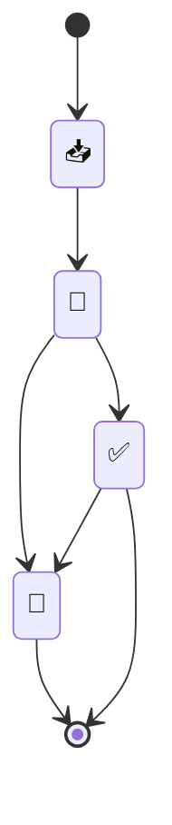

---
{"dg-publish":true,"permalink":"/meta/docs/tag-explanation/","updated":"2024-11-09T07:17:13.818-08:00"}
---

# processing status
- 📥 - New
-  🌱 - Processing
- ✅ - Processed
- 🌲 - [[!Core System/Evergreen\|Evergreen]]

# content type
- 🕛 - Processing Note
- 🔗 - Reference
- 📰 - Article
- 📺 - Video
- 🎧 - Podcast
- 📖 - Book
- 🗒️ - Note
- 📍 - MOC
- 🥗 - Recipe
- 💻 - Project
- ☢️ - [[!Core System/Atomic\|Atomic]]

# life areas
- 🫂 - family
- 💰 - finance
- 🎯 - goals
- 🏋️‍♀️ - health
- 🏠 - home
- 🎓 - education
- 👤 - personal
- 🌎 - travel
- 🗂️ - work

# output type
- 🎬 - Video
- 🏙️ - Photo
- 📝 - Writing
# project status
- 💪 - Active
- 🍀 - Tending
- 🧊 - Frozen
- Nothing - Done
